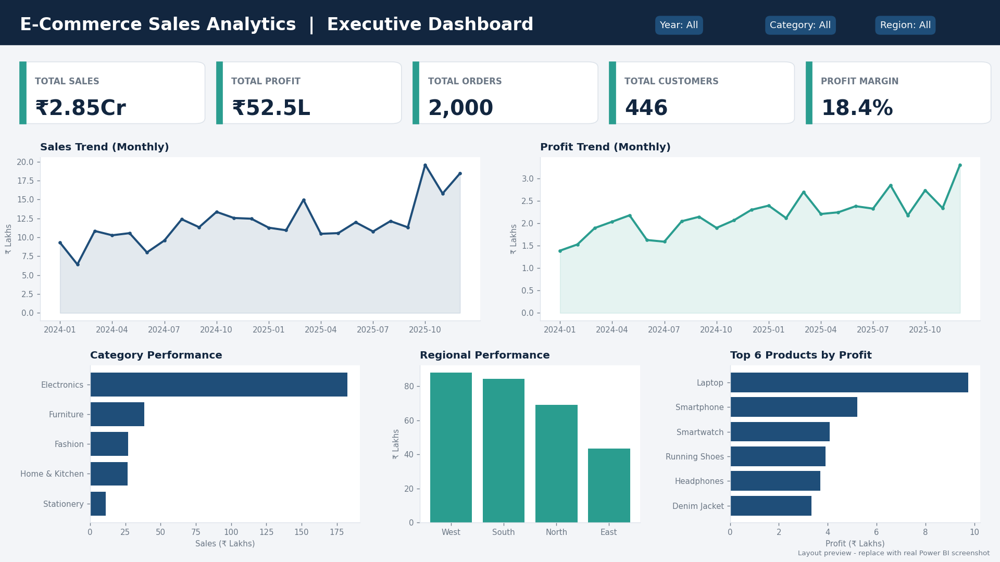

# E-Commerce Sales Analytics

A multi-tool data analytics project: **SQL + Excel + Power BI + Tableau**, with Python used for data cleaning.



## Project Overview
Analyses 2,000 e-commerce orders (Jan 2024 - Dec 2025) to find where sales and profit come from and where money is lost. The dataset is synthetic, built for learning and portfolio use, with realistic links between price, quantity, discount, sales, cost and profit.

## Business Problem
Sales are growing, but is the business growing *profitably*? Which categories, products and regions drive profit? Is discounting hurting margin?

## Objectives
- Clean and validate the data
- Calculate KPIs, trends and rankings with SQL
- Build formula-based summaries and charts in Excel
- Build executive dashboards in Power BI and Tableau
- Give clear business recommendations

## Tools Used
| Tool | What it is used for |
|---|---|
| **SQL** (main) | 25 queries: KPIs, trends, window functions, CTEs, customer segments, discount impact |
| **Excel** | Formula-driven summary sheets (SUMIFS, COUNTIFS), KPI dashboard, PivotTable and slicers |
| **Power BI** | One-screen executive dashboard, DAX measures, slicers |
| **Tableau** | Interactive dashboard with calculated fields, published on Tableau Public |
| **Python** (light) | Cleaning, validation, feature creation, export of clean CSV |
| **Git / GitHub** | Version control and portfolio hosting |

## Project Workflow
```
Raw CSV -> Python cleaning -> Clean CSV -> SQL analysis
                                        -> Excel summaries
                                        -> Power BI dashboard
                                        -> Tableau dashboard -> Business insights
```

## Dataset
`data/ecommerce_sales.csv` - 2,000 rows, 14 columns (Order_ID, Order_Date, Customer_ID, Product, Category, Region, City, Quantity, Unit_Price, Discount, Sales, Cost, Profit, Payment_Mode).
`Sales = Quantity x Unit_Price x (1 - Discount)` and `Profit = Sales - Cost`.
`data/ecommerce_sales_clean.csv` is the cleaned file with extra columns (Year, Month, Year_Month, Profit_Margin_Pct, Discount_Band, Is_Loss).

## Key Analysis
- **SQL** (`sql/analysis.sql`): KPIs, monthly trend, MoM growth (`LAG`), running total, top products per category (`RANK`), customer segments (CTE + `CASE`), top-20% customer share (`NTILE`), discount impact, loss-making products
- **Excel** (`excel/`): `SUMIFS` based Monthly, Category, Region, Product and Discount sheets plus a KPI dashboard with 5 charts
- **Power BI** (`powerbi/`): KPI cards, sales and profit trends, category, region and top-product visuals with Date, Category and Region slicers
- **Tableau** (`tableau/`): same story with calculated fields and dashboard filter actions
- **Python** (`python/analysis.ipynb`): missing values, duplicates, business-rule validation, feature creation

## Dashboard
Power BI: one-screen executive view with 5 KPIs and 5 visuals. Build steps and DAX are in `powerbi/DASHBOARD_GUIDE.md`.
Tableau: `tableau/TABLEAU_GUIDE.md`. Public link: _add your Tableau Public link here_

## Key Insights
| Metric | Result |
|---|---|
| Total sales | ₹2.85 Cr (₹28,532,769) |
| Total profit | ₹52.5 L (₹5,254,032) |
| Profit margin | 18.4% |
| Orders / customers | 2,000 / 446 |
| Sales growth 2025 vs 2024 | +24.5% |

1. **Electronics is 64% of sales but has only a 13.4% margin.** Fashion (44.1%) and Stationery (40.4%) are far more profitable per rupee.
2. **Discounts erode profit.** Margin falls from 26.2% (no discount) to 7.0% at 20% and 2.5% at 25%.
3. **Orders with 15%+ discount are 32% of orders but only 14% of profit.**
4. **Electronics margin drops from 26.8% to 6.2% on heavy-discount orders. Furniture goes negative (-3.3%).**
5. **71 orders (3.5%) were sold below cost**, losing ₹135,474. Tablet, Smartphone and Sofa Set lose the most.
6. **Weakest margins:** Tablet (6.6%), Sofa Set (7.8%), Office Chair (8.4%). **Top profit products:** Laptop, Smartphone, Smartwatch.
7. **Festive season (Oct-Dec) brings 32% of sales.** Best month: October 2025.
8. **The top 20% of customers bring 52.6% of sales.**
9. **West leads sales (₹87.9 L); South has the best margin (19.6%).** UPI is the top payment mode (38%).

## Business Recommendations
1. Cap discounts at 10-15%, especially on Electronics and Furniture.
2. Stop deep discounts on Tablet, Sofa Set and Office Chair, or renegotiate supplier cost.
3. Promote high-margin categories (Fashion, Stationery, Home & Kitchen) through bundles and cross-sell.
4. Plan stock and marketing early for Oct-Dec.
5. Start a loyalty programme for top customers.

## Project Structure
```
ecommerce-sales-analytics/
├── data/
│   ├── ecommerce_sales.csv
│   └── ecommerce_sales_clean.csv
├── sql/analysis.sql
├── excel/
│   ├── ecommerce_sales_analysis.xlsx
│   └── EXCEL_GUIDE.md
├── powerbi/
│   ├── dashboard.pbix
│   └── DASHBOARD_GUIDE.md
├── tableau/TABLEAU_GUIDE.md
├── python/analysis.ipynb
├── screenshots/dashboard.png
├── README.md
├── requirements.txt
└── .gitignore
```

## How to Run
1. **SQL:** open DB Browser for SQLite, import `data/ecommerce_sales.csv` as table `ecommerce_sales`, run `sql/analysis.sql`.
2. **Excel:** open `excel/ecommerce_sales_analysis.xlsx`.
3. **Power BI:** open `powerbi/dashboard.pbix` in Power BI Desktop (free).
4. **Tableau:** open Tableau Public, connect to `data/ecommerce_sales_clean.csv`.
5. **Python (optional):** upload `python/analysis.ipynb` to Google Colab, Run all, upload the CSV when asked.

## Author
**Susheen** - aspiring Data Analyst
[LinkedIn](https://www.linkedin.com/) · [GitHub](https://github.com/)

> Data is synthetic and created for portfolio purposes. It does not represent any real company.
